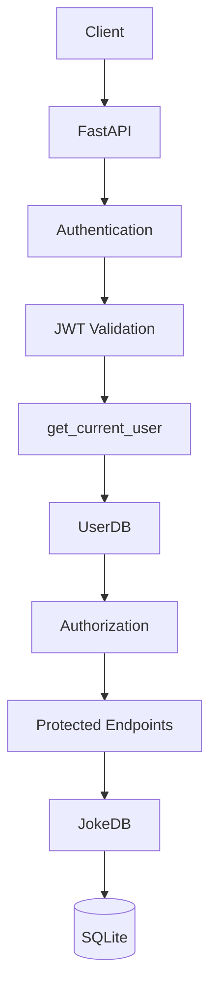
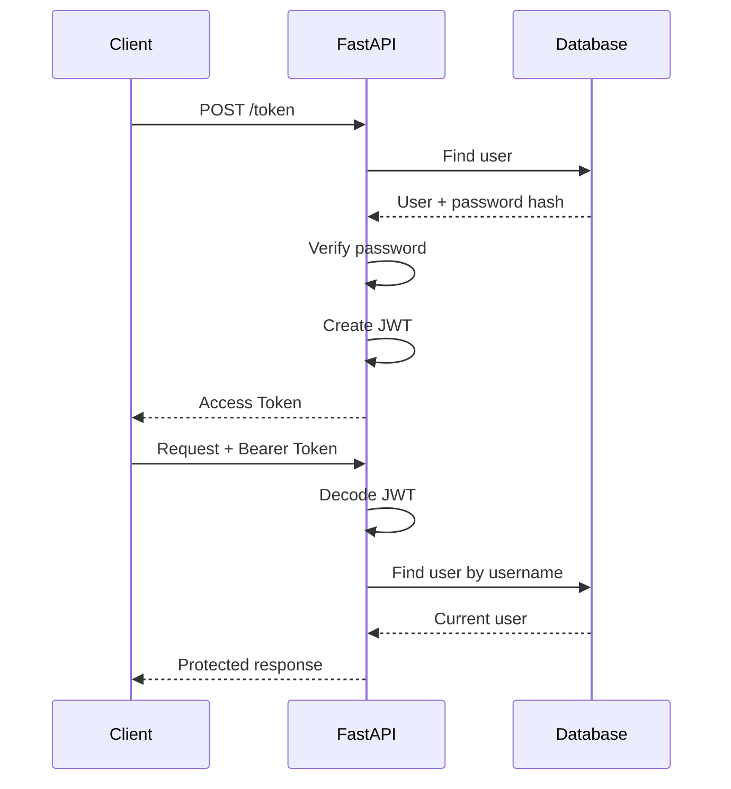

# 🚀 FastAPI Course Project

> A practical FastAPI project built during my journey into backend development and APIs with Python, as part of my path toward becoming an **AI Engineer**.

<p align="center">


</p>

---

## 📌 Table of Contents

* [✨ Features](#-features)
* [🛠️ Technologies](#️-technologies)
* [🏗️ Architecture](#️-architecture)
* [🔐 Authentication Flow](#-authentication-flow)
* [🛡️ Authorization](#️-authorization)
* [📚 API Endpoints](#-api-endpoints)
* [🗄️ Database](#️-database)
* [⚙️ Installation](#️-installation)
* [📖 API Documentation](#-api-documentation)
* [🎯 Learning Goals](#-learning-goals)
* [✅ Project Status](#-project-status)

---

## ✨ Features

<details>
<summary>🔽 Click to explore</summary>

### API Development

* REST-style API endpoints
* CRUD operations
* Query parameters
* Filtering
* Pagination
* Partial updates with `PATCH`
* Bulk creation

### Database

* SQLite integration
* SQLModel ORM
* Database sessions
* Database queries using `select()`

### Authentication & Security

* OAuth2 password authentication
* JWT access tokens
* Password hashing with Argon2
* Token expiration
* Protected endpoints
* Role-based authorization
* Environment variables for sensitive configuration

### API Documentation

* Automatic OpenAPI documentation
* Swagger UI
* ReDoc

</details>

---

## 🛠️ Technologies

| Technology       | Purpose               |
| ---------------- | --------------------- |
| 🐍 Python        | Programming language  |
| ⚡ FastAPI        | API framework         |
| 🗃️ SQLModel     | Database ORM          |
| 💾 SQLite        | Database              |
| ✅ Pydantic       | Data validation       |
| 🔐 OAuth2        | Authentication        |
| 🎫 JWT           | Access tokens         |
| 🔒 pwdlib        | Password hashing      |
| 🌱 python-dotenv | Environment variables |
| 🚀 Uvicorn       | ASGI server           |

---

## 🏗️ Architecture



The project separates the main responsibilities into:

```text
Client
  ↓
FastAPI Routes
  ↓
Dependencies
  ↓
Authentication
  ↓
Authorization
  ↓
Database
```

---

## 🔐 Authentication Flow



### Token Example

```text
Authorization: Bearer <access_token>
```

The JWT contains the user's identity through the `sub` claim and an expiration time through `exp`.

---

## 🛡️ Authorization

The API uses role-based authorization.

| Role       | Permissions                     |
| ---------- | ------------------------------- |
| 👤 `user`  | Access protected joke endpoints |
| 👑 `admin` | Access admin-only operations    |

For example:

```text
DELETE /jokes/{joke_id}
```

A regular user receives:

```json
{
  "detail": "Not enough permissions"
}
```

with:

```text
403 Forbidden
```

An admin can successfully perform the operation.

---

## 📚 API Endpoints

<details>
<summary>🔽 Authentication</summary>

| Method | Endpoint    | Description                    |
| ------ | ----------- | ------------------------------ |
| `POST` | `/token`    | Login and receive JWT          |
| `GET`  | `/users/me` | Get current authenticated user |

</details>

<details>
<summary>🔽 Joke API</summary>

| Method   | Endpoint           | Description             | Access           |
| -------- | ------------------ | ----------------------- | ---------------- |
| `GET`    | `/jokes`           | Get jokes               | 🔐 Authenticated |
| `GET`    | `/jokes/{joke_id}` | Get one joke            | 🔐 Authenticated |
| `POST`   | `/jokes/bulk`      | Create multiple jokes   | 🔐 Authenticated |
| `PUT`    | `/jokes/{joke_id}` | Replace a joke          | 🔐 Authenticated |
| `PATCH`  | `/jokes/{joke_id}` | Partially update a joke | 🔐 Authenticated |
| `DELETE` | `/jokes/{joke_id}` | Delete a joke           | 👑 Admin         |

</details>

---

## 🔎 Query & Pagination

The `GET /jokes` endpoint supports filtering and pagination.

Example:

```text
GET /jokes?author=Mohammed&skip=0&limit=10
```

Supported parameters:

| Parameter | Description                         |
| --------- | ----------------------------------- |
| `author`  | Filter jokes by author              |
| `skip`    | Number of records to skip           |
| `limit`   | Maximum number of records to return |

---

## ✅ Data Validation

Incoming joke data is validated using Pydantic.

Example:

```json
{
  "author": "Mohammed",
  "joke": "This is a test joke for my API.",
  "source": "Test"
}
```

Validation rules include:

* `author`: 3–80 characters
* `joke`: 10–500 characters
* `source`: 3–100 characters

Invalid requests are automatically rejected by FastAPI.

---

## 🗄️ Database

The project uses **SQLite + SQLModel**.

### Main Models

```text
UserDB
├── id
├── username
├── password_hash
└── role

JokeDB
├── id
├── author
├── joke
└── source
```

Database access is handled through FastAPI dependency injection.

---

## ⚙️ Installation

### 1. Clone the repository

```bash
git clone https://github.com/mohammed-gh99/Fast-API---course.git
cd Fast-API---course/fastapi-course
```

### 2. Create a virtual environment

```bash
python -m venv .venv
```

### 3. Activate it on Git Bash

```bash
source .venv/Scripts/activate
```

### 4. Install dependencies

```bash
pip install -r requirements.txt
```

### 5. Create `.env`

Create a local `.env` file:

```env
SECRET_KEY=your_secret_key
```

> ⚠️ Never commit `.env` to GitHub.

### 6. Run the application

```bash
python -m uvicorn main:app --reload
```

---

## 📖 API Documentation

Once the server is running:

### Swagger UI

👉 `http://127.0.0.1:8000/docs`

### ReDoc

👉 `http://127.0.0.1:8000/redoc`

Swagger allows you to interact directly with the API from your browser.

---

## 🧪 Example Authentication

<details>
<summary>🔽 Login</summary>

Send credentials to:

```text
POST /token
```

Example:

```text
username = mohammed
password = ********
```

The API returns:

```json
{
  "access_token": "YOUR_ACCESS_TOKEN",
  "token_type": "bearer"
}
```

Use the returned token to authorize protected endpoints.

</details>

---

## 🧠 Key Concepts Practiced

<details>
<summary>🔽 Concepts covered in this project</summary>

* FastAPI application structure
* HTTP methods
* Path parameters
* Query parameters
* Request bodies
* Pydantic models
* Response models
* Data validation
* CRUD operations
* SQLModel
* SQLite
* Database sessions
* Dependency Injection
* OAuth2
* Password hashing
* JWT
* Authentication
* Authorization
* Role-based access control
* Environment variables
* API testing

</details>

---

## 🎯 Learning Goals

This project was created to build a practical foundation in API development and backend concepts that will be useful later when building **AI-powered applications and services**.

The project is intentionally focused on the fundamentals, while more advanced API architecture and production practices will be explored later.

---

## ✅ Project Status

**Completed ✅**

This project represents my foundational FastAPI/API implementation before moving forward with the next stages of my **AI Engineering learning path**.

---

<p align="center">

⭐ Feel free to explore the project and experiment with the API.

</p>
